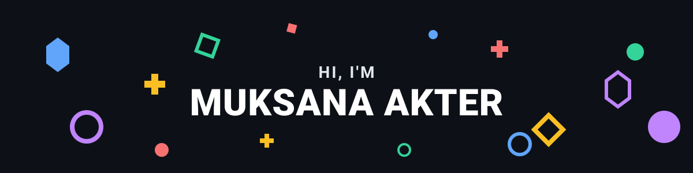

  

<h1 align="center">
  
  Welcome to my creative space!
  
</h1>

  <em>✨ Crafting beautiful & performant web & mobile experiences with passion 💜 ✨</em>

  

  
  
  

### 👩‍💻 A little about me...

I'm a passionate **Full Stack & Mobile Developer** who loves turning complex problems into simple, beautiful, and intuitive designs. 

- 💼 Currently working as a Software Developer at **[XIIA](https://www.linkedin.com/company/xiia)**
- 📱 Building cross-platform apps with **React, Next.js & React Native**
- 🎨 Deeply focused on **pixel-perfect UIs**, smooth animations, and thoughtful UX
- ⚡ Capable backend builder: **Node.js, Express, Firebase & MongoDB**
- 🌱 Constantly exploring new technologies and improving my craft
- 🚀 Always shipping, always growing!

 

---

### 🚀 What I do

- ✨ Turn Figma designs into production-ready web & mobile experiences  
- 🧩 Build clean UI with Tailwind, Styled Components & Framer Motion  
- 🔗 Connect apps to REST APIs, GraphQL & Firebase  
- 📲 Ship cross-platform mobile apps with React Native  
- 🧠 Keep learning new patterns, tools, and better ways to build  

---

### 💻 Tech Stack

  
  
  
  
  
  
  
  
  
  
  
  
  
  
  
  
  
  
  

---

### 📊 GitHub Stats

  
  

  

  

---

### 🌐 Connect with me

  
  
  

  

